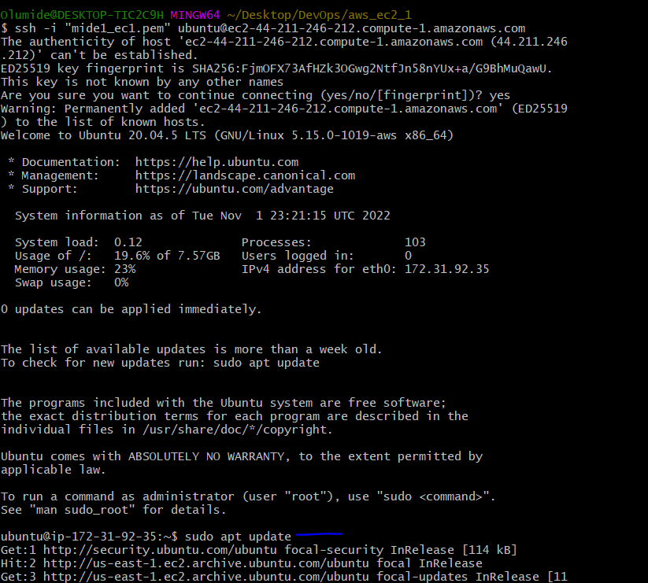

## **LOAD BALANCER SOLUTION WITH APACHE**

### From the [Tooling_web_solution](https://github.com/olumide-ajayi/Tooling_web_solution) one might wonder how a user will be accessing each of the webservers using 3 different IP addreses or 3 different DNS names. You might also wonder what is the point of having 3 different servers doing exactly the same thing.
### When we access a website in the Internet we use an URL and we do not really know how many servers are out there serving our requests, this complexity is hidden from a regular user, but in case of websites that are being visited by millions of users per day (like Google or Reddit) it is impossible to serve all the users from a single Web Server.
### Each URL contains a domain name part, which is translated (resolved) to IP address of a target server that will serve requests when open a website in the Internet. Translation (resolution) of domain names is perormed by DNS servers, the most commonly used one has a public IP address 8.8.8.8 and belongs to Google.

### In order to hide all this complexity and to have a single point of access with a single public IP address/name, a Load Balancer can be used. A Load Balancer (LB) distributes clients’ requests among underlying Web Servers and makes sure that the load is distributed in an optimal way.

## Project design

### Here, enhancment will be done on the Tooling Website solution by adding a Load Balancer to disctribute traffic between Web Servers and allow users to access the website using a single URL.


### The task here is to deploy and configure an Apache Load Balancer for Tooling Website solution on a separate Ubuntu EC2 intance. Make sure that users can be served by Web servers through the Load Balancer. To simplify, let us implement this solution with 2 Web Servers, the approach will be the same for 3 and more Web Servers. Instructions On How To Submit Your Work For Review And Feedback.

## **Prerequisites**
*Already have the following servers installed and configured within [Tooling_web_solution](https://github.com/olumide-ajayi/Tooling_web_solution):*
* Two RHEL8 Web Servers
* One MySQL DB Server (based on Ubuntu 20.04)
* One RHEL8 NFS server

### **Configure Apache As A Load Balancer**
*Create an Ubuntu Server 20.04 EC2 instance and give it a prefered name on AWS:*


*Open TCP port 80 on the newly deployed instance by creating an Inbound Rule in Security Group*

*Install Apache Load Balancer on the server and configure it to point traffic coming to LB to both Web Servers*

`sudo apt update`



`sudo apt upgrade -y`

`sudo apt install apache2 -y`


`sudo apt-get install libxml2-dev`


*Enable the following modules:*

`sudo a2enmod rewrite`

`sudo a2enmod proxy`

`sudo a2enmod proxy_balancer`

`sudo a2enmod proxy_http`

`sudo a2enmod headers`

`sudo a2enmod lbmethod_bytraffic`


*Restart apache2 service. Screen shot above shows it;*

`sudo systemctl restart apache2`

`sudo systemctl status apache2`

*Configure load balancing using prefered editor, and add the configuration below in the Virtual host section as also indicated in the screen shot. Ensure the enter the web servers IP addresses where indicated. This can be done for for more than 2 web servers as in this case 2 web servers was use;*

`sudo vi /etc/apache2/sites-available/000-default.conf`

```
#Add this configuration into this section <VirtualHost *:80>  </VirtualHost>
<Proxy "balancer://mycluster">
               BalancerMember http://<WebServer1-Private-IP-Address>:80 loadfactor=5 timeout=1
               BalancerMember http://<WebServer2-Private-IP-Address>:80 loadfactor=5 timeout=1
               ProxySet lbmethod=bytraffic
               # ProxySet lbmethod=byrequests
        </Proxy>
ProxyPreserveHost On
        ProxyPass / balancer://mycluster/
        ProxyPassReverse / balancer://mycluster/
```
*Restart apache server*

`sudo systemctl restart apache2`


*Verify that configuration works – try to access LB’s public IP address or Public DNS name from your browser: `http://<Load-Balancer-Public-IP-Address-or-Public-DNS-Name>/index.php`;*


*Note: If in the Tooling web solution project, you mounted /var/log/httpd/ from your Web Servers to the NFS server – unmount them and make sure that each Web Server has its own log directory;*

`sudo umount -f /var/log/httpd`

*Open two ssh/Putty consoles for both Web Servers (all) and run following command:*

`sudo tail -f /var/log/httpd/access_log`

*Try to refresh your browser page `http://<Load-Balancer-Public-IP-Address-or-Public-DNS-Name>/index.php` several times and make sure that both servers receive HTTP GET requests from your LB – new records must appear in each server’s log file. The number of requests to each server will be approximately the same since we set loadfactor to the same value for both servers – it means that traffic will be disctributed evenly between them.*


### **Optional Step – Configure Local DNS Names Resolutio**n

*Sometimes it is tedious to remember and switch between IP addresses, especially if you have a lot of servers under your management.What we can do, is to configure local domain name resolution. The easiest way is to use /etc/hosts file, although this approach is not very scalable, but it is very easy to configure and shows the concept well. So let us configure IP address to domain name mapping for our LB.*

*Open this file on your LB server;*

`sudo vi /etc/hosts`

*Add 2 records into this file with Local IP address and arbitrary name for both of your Web Servers*

`<WebServer1-Private-IP-Address> Web1`

`<WebServer2-Private-IP-Address> Web2`

*Now you can update your LB config file with those names instead of IP addresses.*

```
BalancerMember http://Web1:80 loadfactor=5 timeout=1
BalancerMember http://Web2:80 loadfactor=5 timeout=1
```


*You can try to curl your Web Servers from LB locally `curl http://Web1` or `curl http://Web2` – it shall work.
Remember, this is only internal configuration and it is also local to your LB server*


